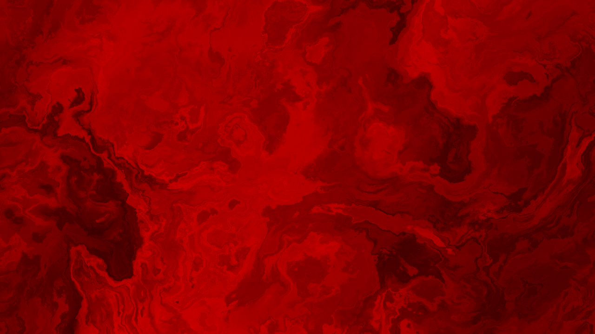
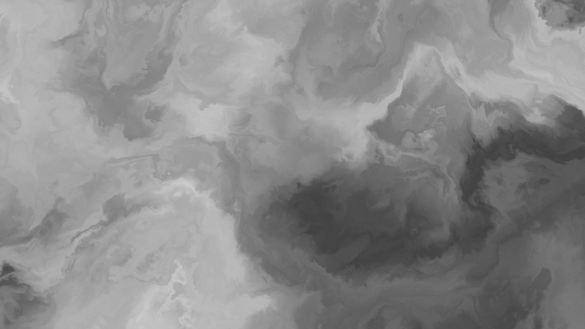
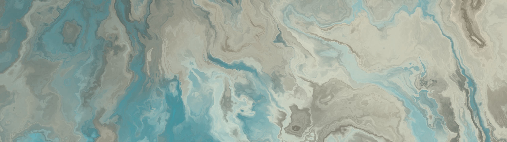
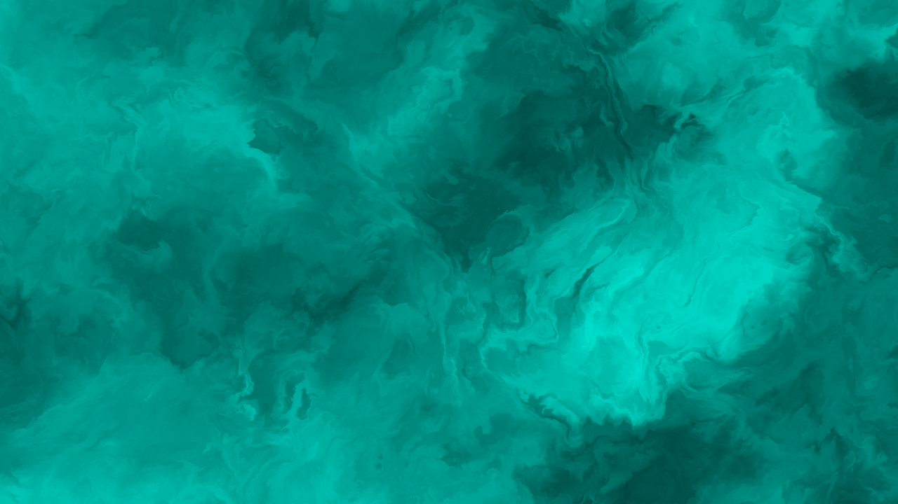
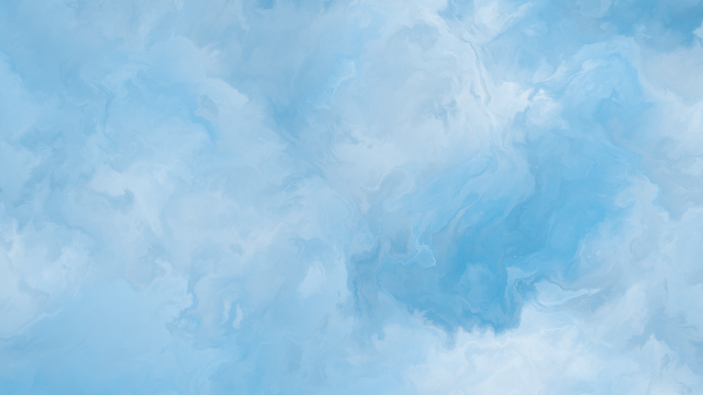

<!-- HEADER -->

  

  <h3 align="center">Amber</h3>
  
  

    A simple way to generate beautiful images
     
     
    <a href="https://github.com/its-nion/amber/releases/latest">Latest Build</a>
    ·
    <a href="https://github.com/its-nion/Amber/issues/new?assignees=&labels=bug&projects=&template=bug_report.md&title=">Report Bug</a>
  

 

<!-- TOC -->
## Table of Contents
- [About](#about)
- [Features](#features)
- [Sample Images](#sample-images)
- [Developement](#developement)
- [Usage](#usage)

 

<!-- ABOUT -->
## About
Amber is a lightweight application that lets you design stunning patterns in real-time and export them as high-quality PNGs. It’s a quick and easy way to create abstract visuals or placeholders.

  

 

<!-- FEATURES -->
## Features
- **Lightweight** · No installation or large files required
- **Easy to use** · Simple, user-friendly interface
- **Customizable** · Full control over every design element
- **High Quality** · Images are drawn directly in your preferred resolution

 

<!-- SAMPLE IMAGES -->
## Sample Images

  
  
  
  
  

 

<!-- Developement -->
## Developement

 

<!-- Usage -->
## Usage
