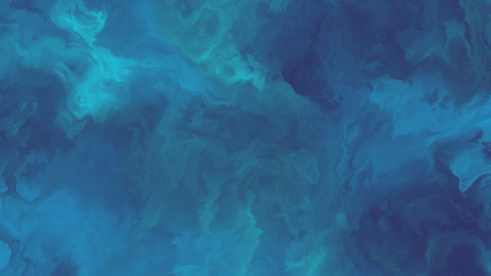
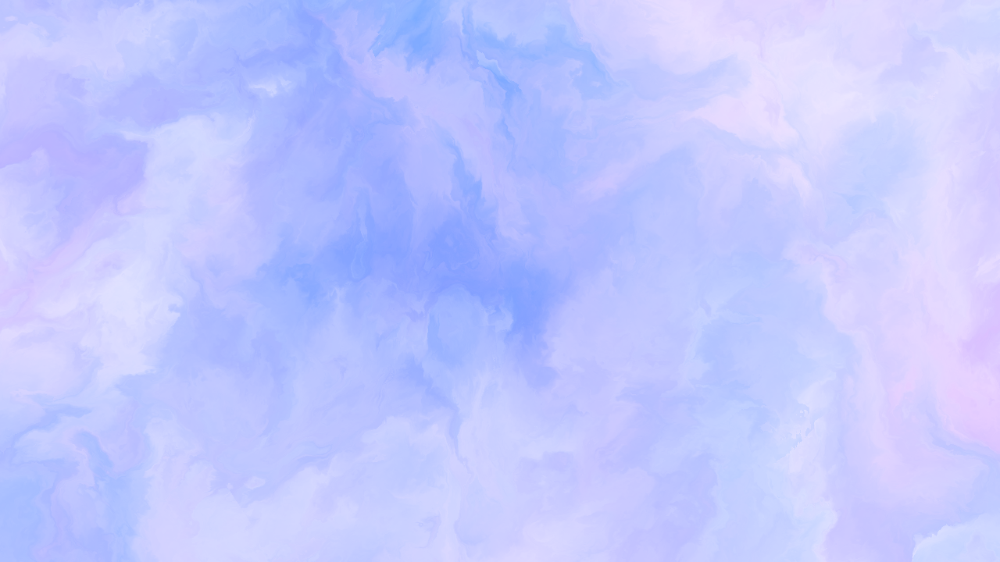
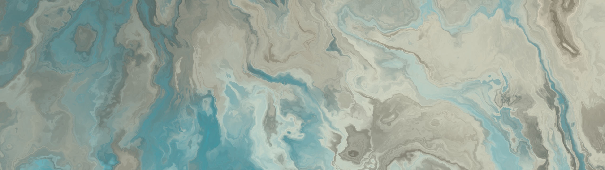
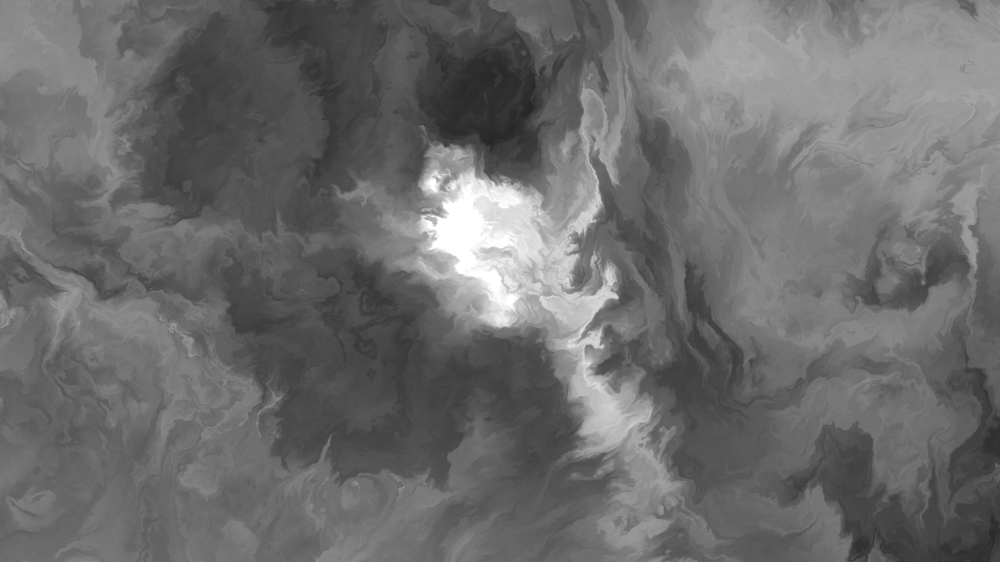
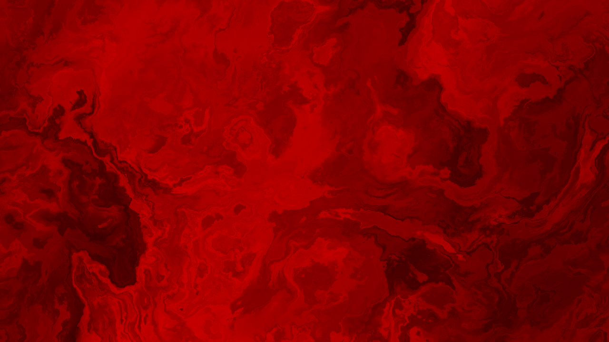

<!-- HEADER -->
<div align="center">
  <a href="https://github.com/its-nion/Amber">
    
  </a>

  <h3 align="center">Amber</h3>
  
  <p align="center">
    A simple way to generate beautiful images
    <br />
    <br />
    <a href="https://github.com/its-nion/amber/releases/latest">Latest Build</a>
    ·
    <a href="https://github.com/its-nion/Amber/issues/new?assignees=&labels=bug&projects=&template=bug_report.md&title=">Report Bug</a>
  </p>
</div>

<br />

<!-- TOC -->
## Table of Contents
- [About](#about)
- [Features](#features)
- [Sample Images](#sample-images)
- [Used Technologies](#used-technologies)
- [How It Works](#how-it-works)
- [Running Amber](#running-amber)
- [Building Amber](#building-amber)
- [Future Improvements](#future-improvements)
- [Acknowledgments](#acknowledgments)

<br />

<!-- ABOUT -->
## About
Amber is a lightweight image generator that lets you design stunning patterns in real-time and export them as high-quality PNGs. It’s a quick and easy way to create beautiful visuals.

<br />

<div style="display: flex", align="center">
  
</div>

<br />

<!-- FEATURES -->
## Features
- **Lightweight** · No installation or large files required
- **Customizable** · Full control over every design element
- **High Quality** · Images are drawn directly in your preferred resolution
- **Free** · No cost whatsoever!

<br />

<!-- SAMPLE IMAGES -->
## Sample Images
<div style="display: flex", align="center">
  
  
  
  
  
</div>

<br />

<!-- Used Technologies -->
## Used Technologies
Amber utilizes the following libraries and frameworks:
- [Vulkan SDK](https://www.lunarg.com/vulkan-sdk/) – Rendering and execution of compute shaders on the gpu
- [GLFW](https://www.glfw.org/) – Cross-platform window and input handling
- [GLM](https://github.com/g-truc/glm) – Mathematical functions and data structures for graphics computations
- [ImGui](https://github.com/ocornut/imgui) – User interface for the editor
- [stb_image](https://github.com/nothings/stb) – Image loading and processing
- [VkBootstrap](https://github.com/charles-lunarg/vk-bootstrap) – Simplifies Vulkan initialization
- [Vulkan Memory Allocator (VMA)](https://github.com/GPUOpen-LibrariesAndSDKs/VulkanMemoryAllocator) – Manages efficient GPU memory allocation
- [Bin2cpp](https://github.com/end2endzone/bin2cpp) – Embedding shaders and images directly into the application as C++ headers
- [Tinyfiledialogs](https://github.com/native-toolkit/libtinyfiledialogs) – Native file dialog management for image export

<br />

<!-- How It Works -->
## How It Works
Amber starts by creating a window with GLFW, providing a cross-platform foundation for user input. It then initializes Vulkan to manage GPU-heavy computations. With Vulkan in place, Amber builds a compute shader pipeline, enabling parallel execution of small GPU programs (shaders), that generate and manipulate images in real time. Specifically, it employs fractal noise (FBM) and warping effects to produce dynamic visuals. [(more)](#acknowledgments)

To give users full control over the image, Amber features an ImGui-based UI that allows real-time parameter adjustments through Push-Constants. This makes modifying parameters, experimenting with presets, and fine-tuning rendering settings possible. Once a desired look is achieved, the image can be exported as a PNG.

<br />

<!-- Running Amber -->
## Running Amber
Amber is currently only supported on windows. Follow these steps to run it:

1. Go to the [latest release page](https://github.com/its-nion/amber/releases/latest)
2. Download ``Amber.exe``
3. Run ``Amber.exe``
4. Hover over "File" in the top left corner and press "New" to create an image in a desized resolution
5. Customize your image via the user interface on the right. If you're looking for a good starting point, check out the presets in the menu bar
6. Hover over "File" in the top left corner and press "Export" to save your image

<br />

> [!Warning]  
> The executable file got flagged as a virus on my pc, probably because it's a singular small file. If that happens to you aswell, you can either quarantine the file from the windows defender firewall or build the file yourself, which is explained in the next step.

<br />

## Building Amber
1. Download or Clone the repository:
```
git clone https://github.com/its-nion/amber.git
```
2. Go into the "visual-studio" folder and open "Amber.sln" with Visual Studio
3. Build/Run the project

<br />

> [!Note]  
> To build the project, you need to have the Vulkan SDK installed. All other libraries should be included in the "third-party" folder, but make sure that all dependencies are linked correctly.

<br />

<!-- Future Improvements -->
## Future Improvements
- Expand shader functionality for additional visual effects
- Clean up project structure
- Additional export formats

<br />

<!-- Acknowledgments -->
## Acknowledgments
Special thanks to the individuals below, whose articles served as inspiration and played a key role in making this project a reality
- **Victor Blanco** with his [Vulkan Guide](https://vkguide.dev/)
- **Patricio Gonzalez Vivo & Jen Lowe** with their article about [Fractal Brownian Motion](https://thebookofshaders.com/13/)
- **Inigo Quilez** with his article about [Domain Warping](https://iquilezles.org/articles/warp/)
